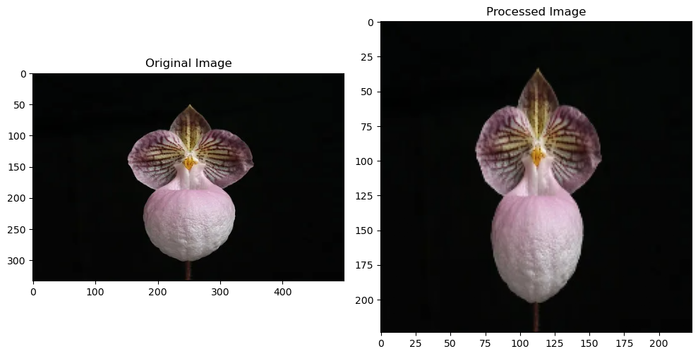
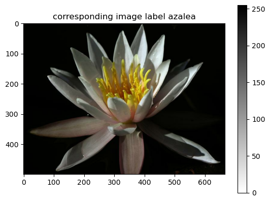
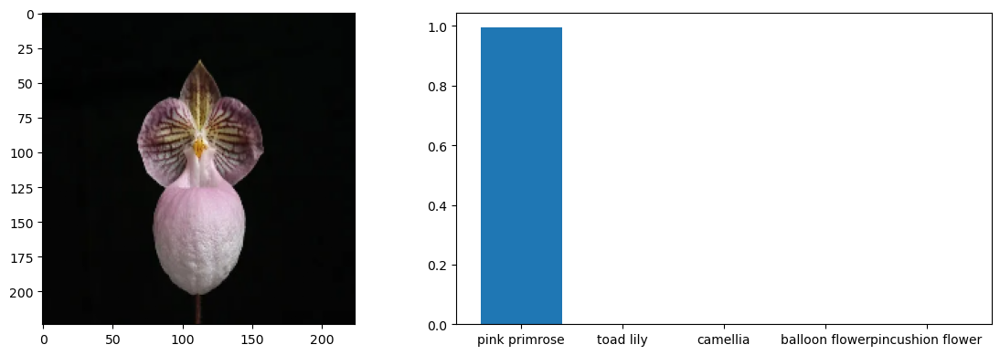

# Flower Classification using DL 

## PROJECT TITLE

Flower Detection using Deep Learning 

## GOAL

To identify whether the flower image. 

## DATASET

The link for the dataset used in this project:  https://www.tensorflow.org/datasets/catalog/oxford_flowers102
It has 102 classes of Classification

## DESCRIPTION

This project aims to identify the flower name using Deep Learning.

## WHAT I HAD DONE

1. Data collection: From the link of the dataset given above using TensorflowDataset. 
2. Data preprocessing: Preprocessed the image according to the requirement of the model.
3. Model selection: Resnet50 and Mobilnet V2 with a added Dense Classification Layer
4. Comparative analysis: Compared the accuracy score of all the models.

## Exploratory Data Analysis

Sample data: 

Total Number of Training Images: 1020
Total Number of Validation Images: 1020
Total Number of Test Images: 6149 

Total Number of Classes of Flowers: 102

## MODELS SUMMARY

Model: "sequential_3" Mobilenet:
_________________________________________________________________
 Layer (type)                Output Shape              Param #   
=================================================================
 keras_layer_2 (KerasLayer)  (None, 1280)              2257984   
                                                                 
 dense_4 (Dense)             (None, 102)               130662    
                                                                 
=================================================================
Total params: 2388646 (9.11 MB)
Trainable params: 130662 (510.40 KB)
Non-trainable params: 2257984 (8.61 MB)
_________________________________________________________________

Model: "sequential_4" Resnet:
_________________________________________________________________
 Layer (type)                Output Shape              Param #   
=================================================================
 keras_layer_3 (KerasLayer)  (None, 1001)              25615849  
                                                                 
 dense_5 (Dense)             (None, 102)               102204    
                                                                 
=================================================================
Total params: 25718053 (98.11 MB)
Trainable params: 102204 (399.23 KB)
Non-trainable params: 25615849 (97.72 MB)
_________________________________________________________________
## LIBRARIES NEEDED

The following libraries are required to run this project:

- matplotlib
- tensorflow
- keras
- PIL

## EVALUATION METRICS

The evaluation metrics I used to assess the models:

- Accuracy 
- Loss

It is shown using Confusion Matrix in the Images folder

## RESULTS
Results on Val dataset:
For Mobilnet:
Accuracy:82%
loss: 0.78

For Model-2:
Accuracy:0.98%
loss: 8875

## Output:

## CONCLUSION
Based on results we can draw following conclusions:

1.The mobilenet model worked better probably because resnet model is surely overfitting as seen here as it is much larger and suited for general object detection.Thus mobilenet is the best model to work with.