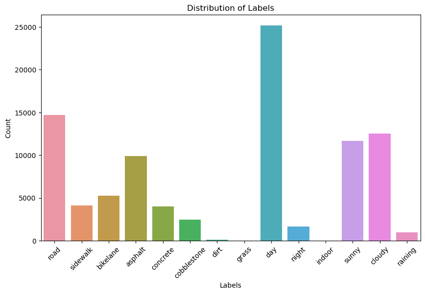
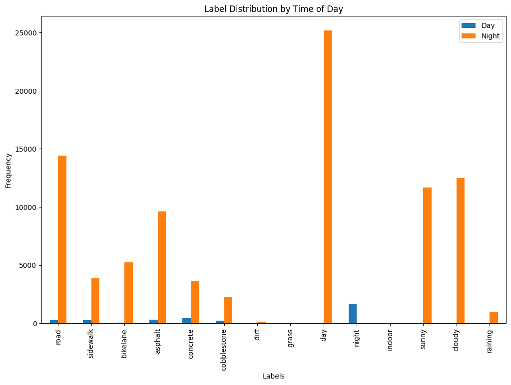
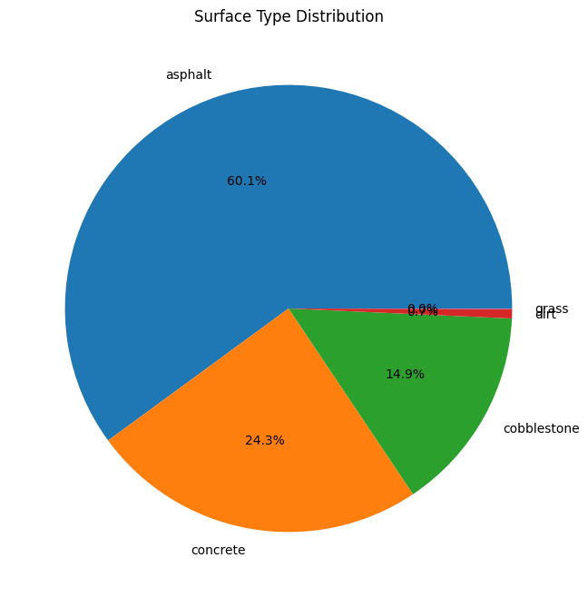
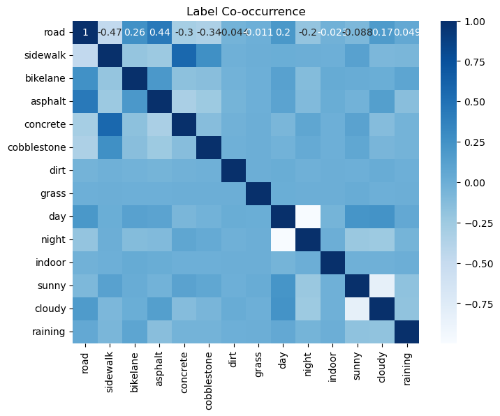
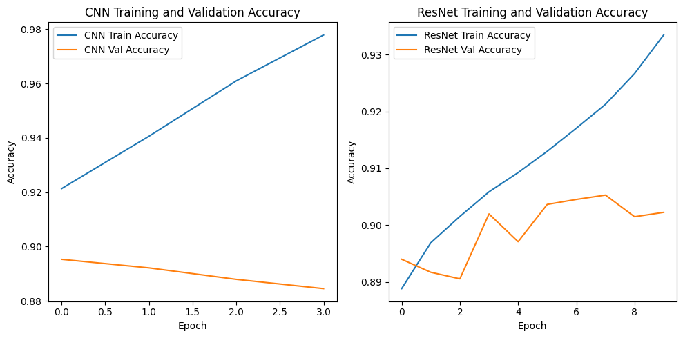

# Micromobility Lane Recognition 

## 🎯 Goal
The main purpose of this project is to **recognize weather condition, lane type, and day time of lines for micromobility** from the dataset (mentioned below) using various image detection/recognition models and comparing their accuracy.                                                                                

## 🧵 Dataset

The link to the dataset is given below :-

**Link :- *https://www.kaggle.com/datasets/kaundanyachinmaya07/micromobility-lane-recognition-dataset*

## 🧾 Description

This project involves the comparative analysis of three Keras image detection models, namely VGG16, InceptionV3, and MobileNet, applied to a specific dataset. The dataset consists of annotated images related to a particular domain, and the objectives include training and evaluating these models to compare their accuracy scores and performance metrics. Additionally, exploratory data analysis (EDA) techniques are employed to understand the dataset's characteristics, explore class distributions, detect imbalances, and identify areas for potential improvement. The methodology encompasses data preparation, model training, evaluation, comparative analysis of accuracy and performance metrics, and visualization of EDA insights. 

## 🧮 What I had done!

### 1. Data Loading and Preparation:
       Loaded the dataset from each directory and mapping them into 1 organized csv file.
       Loaded the dataset from the new organized csv file, containing image paths and corresponding labels, into a pandas DataFrame for easy manipulation and analysis.

### 2. Exploratory Data Analysis (EDA):
       Bar Chart for Label Distribution: Created a bar chart to visualize the frequency distribution of different labels in the dataset.
      
       Grouped Bar Chart for Time of Day: Created a bar chart to visualize the frequency distribution of the labels grouped by the time of the day: 'Day' and 'Night'.

       Grouped Bar Chart for Weather Conditions: Created a bar chart to visualize the frequency distribution of the labels grouped by the time of the day: 'Sunny', 'Cloudy', and 'Raining'.
       
       Pie Chart for Label Distribution: Generated a pie chart to represent the proportion of each surface type:'Asphalt', 'Concrete', 'Cobblestone', 'Dirt', and 'Grass'.

### 3. Data Analysis:
        Constructed a Label Co-Occurrence Matrix, by analyzing which labels tend to occur together, that helped in understanding potential correlations between labels.

### 4. Data Preprocessing:
        Dropped Nan Columns.
        Resized, transformed and normalized the images.

### 5. Model Training:
        Divided the dataset into batches.
        Iterated through multiple models (CNN, ResNet50, VGG16, Logistic Regression).
        Used Early Stopping to prevent overfitting.

## 🚀 Models Implemented

Trained the dataset on various models , each of their summary is as follows :-

### CNN
I utilized Convolutional Neural Networks to enhance image recongintion and classification.

### ResNet50
I leveraged ResNet50, a deep Convolutional Neural Network, to improve image recognition and classification.

### VGG16
I tried to utilize the VGG16 (Visual Geometry Group) architecture, which have deeper and complex structures, but it took so long before being able to get any results.

### Logistic Regression
I used it just to make the difference clear between ML and DL approaches regarding Computer Vision Problems, it took time less than the other DL approaches, but the accuracy was so bad, because it couldn't capture enough details like the other DL models. 

## 📚 Libraries Needed

1. **NumPy**: Fundamental package for numerical computing.
2. **Pandas**: Data analysis and manipulation library.
3. **Scikit-Learn**: Machine learning library for classification, regression, and clustering.
4. **Matplotlib**: Plotting library for creating visualizations.
5. **Pillow (PIL)**: Python Imaging Library for image processing.
6. **OpenCV**: Library for computer vision tasks.
7. **PyTorch**: Deep learning framework for building and training neural networks.
8. **TorchVision**: Computer vision library that works with PyTorch, providing datasets, model architectures, and image transformations.
9. **Pickle**: Python module for serializing and de-serializing objects.

## 📊 Exploratory Data Analysis Results

### Bar Charts :-

- **Bar Chart for Label Distribution**: Created a bar chart to visualize the frequency distribution of different labels in the dataset.

- **Grouped Bar Chart for Time of Day**: Created a bar chart to visualize the frequency distribution of the labels grouped by the time of the day: 'Day' and 'Night'.

- **Grouped Bar Chart for Weather Conditions**: Created a bar chart to visualize the frequency distribution of the labels grouped by the time of the day: 'Sunny', 'Cloudy', and 'Raining'.

### Pie Chart :-

- **Pie Chart for Label Distribution**: Generated a pie chart to represent the proportion of each surface type:'Asphalt', 'Concrete', 'Cobblestone', 'Dirt', and 'Grass'.

### Label Co-Occurrence Matrix

## 📈 Performance of the Models based on the Accuracy Scores

| Models             |       Accuracy Scores|
|--------------------|------------|
|CNN                 | 88% (Training Accuracy: 0.98) |
|ResNet50            | 90% (Training Accuracy: 0.94) |
|VGG16               | --% (Training Accuracy: ----) |
|Logistic Regression | 10% (Training Accuracy: 0.58) |

## 📢 Conclusion

**Accoding to the accuracy scores it can be concluded that ResNet and a simple CNN architecture were able to perform good on this dataset.**

While VGG16 took so much time so it was concluded.

## ✒️ Your Signature

Full name:- Basma Mahmoud                      
Github ID:- https://github.com/Basma2423  
Email ID :- mayarbasma2423@gmail.com  
Participant Role :- Participant / GSSOC (Girl Script Summer of Code ) - 2024                                        
  
  

Helping Reference for the README.md file: https://github.com/abhisheks008/DL-Simplified/blob/main/Rick%20and%20Morty%20Character%20Image%20Detection/Models/README.md
