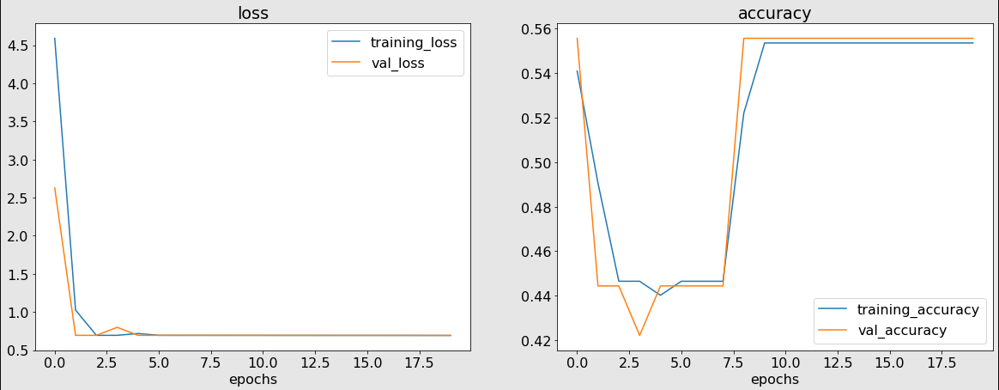
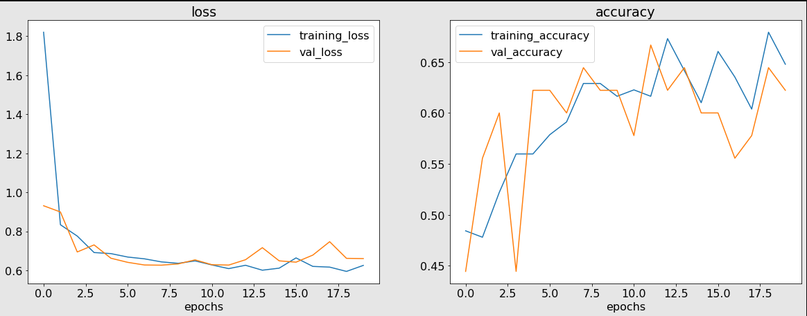
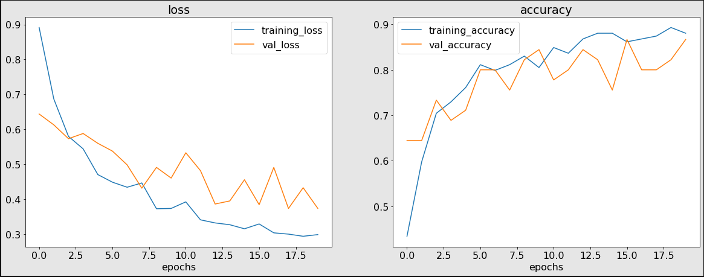
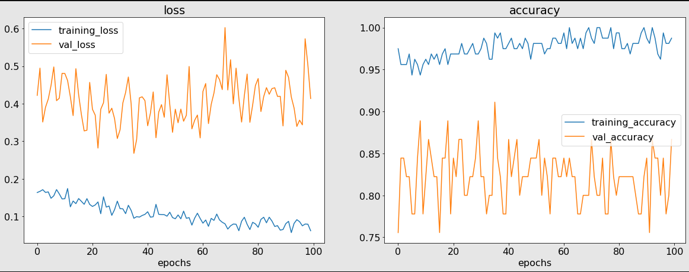

# Monkeypox Detection

**GOAL**

To classify the images from the monkeypox skin lesion dataset using a Deep Learning approach.

**DATASET**

https://www.kaggle.com/datasets/nafin59/monkeypox-skin-lesion-dataset

**DESCRIPTION**

The dataset contains images of 2 different classes, namely MonkeyPox and Others. There are 102 and 126 images of each type respectively. The task is to classify the images by using a deep learning architecture.

**WHAT I HAD DONE**

First I imported all the required libraries and dataset for this project. Then I imported the dataset and split it into training, validation and testing sets in the ratio 70:20:10. Then I proceeded to build the model. 

I have developed 5 deep learning models to classify the images. First I used a ANN to classify the images. But I didn't get a good accuracy. Secondly I used a CNN to classify the images, but the model wasn't performing well. Lastly, I used a CNN with MaxPooling layers but I didn't get a satisfactory accuracy score. 

Then I proceeded with Transfer Learning. I used the [ResNet 50](https://tfhub.dev/google/imagenet/resnet_v2_50/feature_vector/5) model and trained this model on the images from the dataset. I first got some improvements in the accuracy, but after training the model for more epochs I got an accuracy score of 91.66

**MODELS USED**

The models are:

1. Artificial Neural Network (ANN)
2. Convolutional Neural Network (CNN)
3. Convolutional Neural Network (CNN) with MaxPooling layer
4. Transfer Learning Model (ResNet) 20 epochs
5. Transfer Learning Model (ResNet) 100 epochs

**LIBRARIES NEEDED**

* kaggle
* tensorflow
* split-folders
* matplotlib

**VISUALIZATION**

### Images of different Rice classes

### Model 1 (ANN Model) performance graphs

### Model 2 (Basic CNN Model) performance graphs

By viewing the graphs, we can conclude that the model is not performing well. It is overfitting on the training data.

### Model 3 (CNN Model with MaxPooling layer) performance graphs

By adding the MaxPooling layer, the model is now performing better than before.

### Model 4 (Transfer Learning Model (ResNet)) performance graphs

### Model 5 (Transfer Learning Model (ResNet) 100 epochs) performance graphs

### Prediction

Prediction on a random image from the testing dataset.

**ACCURACIES**

| Model         | Architecture              | Accuracy in % (on testing data) |
| ------------- |:-------------------------:|:-------------:|
| Model 1       | ANN Model                 |54.16          |
| Model 2       | Basic CNN Model           |45.83          |
| Model 3       | CNN Model with MaxPooling |50.00          |
| Model 4       | Transfer Learning Model (ResNet) 20 epochs |87.50          |
| Model 5       | Transfer Learning Model (ResNet) 100 epochs |91.66          |

**CONCLUSION**

I was successfully able to develop a Deep Learning model that can classify images from the given monkeypox skin lesion dataset of 2 classes.

**Omkar Jahagirdar**

Connect with me on Linkedin: https://www.linkedin.com/in/omkar-jahagirdar/

Check out my Github profile: https://github.com/omkar3602
